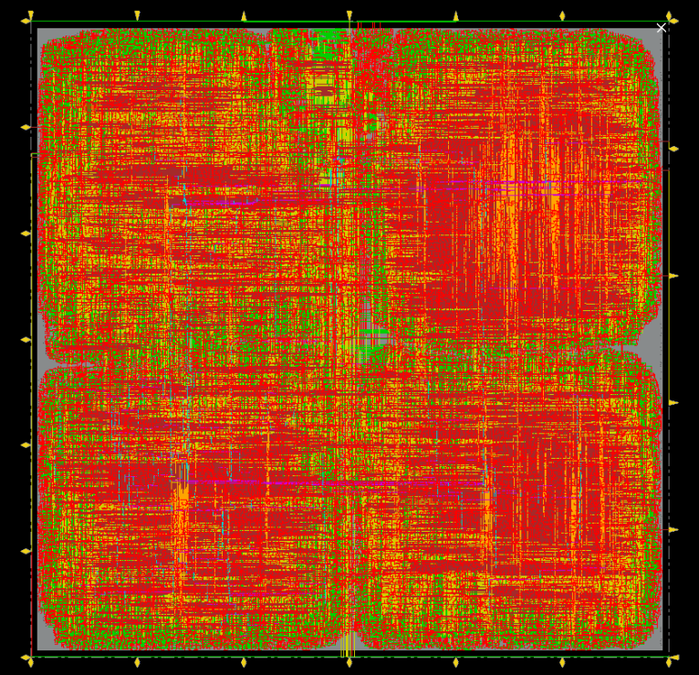
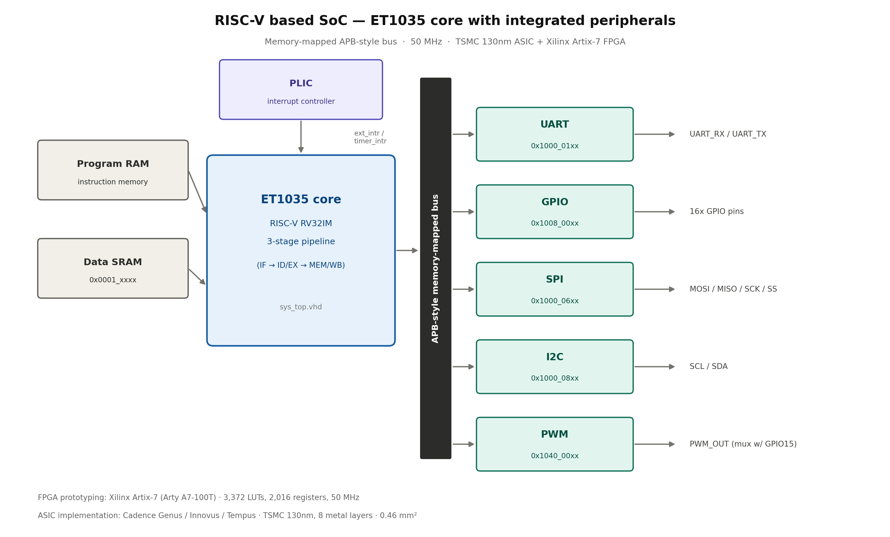
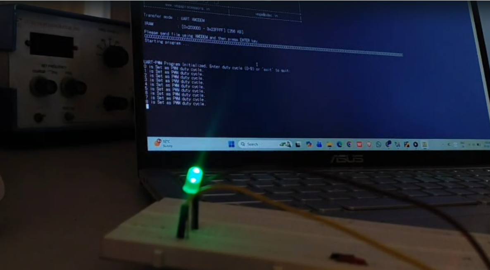

# RISC-V Based SoC — RTL to GDSII Implementation

> Full-stack chip design project: integrated 5 peripheral IP blocks with a RISC-V core, verified on FPGA, and carried the design through a complete ASIC backend flow (synthesis → place & route → sign-off STA) on TSMC 130nm — from architecture study to a tape-out-ready GDSII layout.


<!-- HERO IMAGE — replace with your GDSII layout screenshot or block diagram -->


---

## Overview

This project implements and physically realizes a complete RISC-V-based System-on-Chip built around the **CDAC ET1035 (RV32IM)** processor core, with five custom peripheral interfaces integrated over a memory-mapped APB-style bus:

| Peripheral | Function |
|---|---|
| **UART** | 16550-compatible serial communication, configurable baud rate |
| **GPIO** | 16 bidirectional pins, independently configurable I/O |
| **SPI**  | Master-mode synchronous serial (Modes 0 & 3) |
| **I2C**  | Master-mode two-wire interface, 100/400 kHz |
| **PWM**  | Configurable-duty-cycle waveform generator |

The design was first verified on FPGA, then taken through a **full ASIC backend flow** (synthesis, floorplanning, placement, CTS, routing, STA, DRC/LVS) to a fabrication-ready GDSII layout.

---

## Key Results

| Metric | Result |
|---|---|
| Target Clock | 100 MHz |
| Post-Synthesis WNS | **+0.049 ns** (timing met) |
| Post-Route WNS | +0.405 ns (timing met) |
| Total Instances | 15,260 (2,878 sequential, 11,169 combinational, 1,170 inverters) |
| Total Chip Area (incl. IO pad ring) | 459,749 µm² (≈0.46 mm²) |
| Total Power | 132.87 mW |
| DRC / LVS | 0 violations |
| IR-Drop / EM | Verified at signoff |
| FPGA Utilization (Arty A7-100T) | 3,372 LUTs |
| FPGA Prototyping | Vivado, 50 MHz, UART/GPIO/I2C/PWM validated |

**Tools:** Cadence Genus (synthesis) · Cadence Innovus (place & route) · Cadence Tempus (static timing analysis) · TSMC 130nm PDK · AMD Vivado (FPGA)

---

## Architecture

<!-- Add your block diagram here -->


All five peripherals connect to the ET1035 core through address-decoded, memory-mapped chip selects on the system top-level (`sys_top`):

| Peripheral | Base Address | Interface |
|---|---|---|
| UART | 0x1000_01xx | Custom parallel bus |
| GPIO | 0x1008_00xx | APB-style |
| SPI  | 0x1000_06xx | APB |
| I2C  | 0x1000_08xx | APB |
| PWM  | 0x1040_00xx | APB-style write |

A PLIC (Platform-Level Interrupt Controller) handles UART and timer interrupts to the core.

---

## Physical Design Flow

```
Chip Spec → RTL Design → Functional Verification → FPGA Prototyping
   → Logic Synthesis (Genus) → Floorplanning → Placement
   → Clock Tree Synthesis → Routing → Parasitic Extraction
   → Sign-off STA (Tempus) → DRC/LVS → GDSII Stream-out
```

<!-- Optional: timing report screenshot or power breakdown -->


---

## FPGA Prototyping & Peripheral Verification

Before backend implementation, functionality was validated on a **Digilent Arty A7-100T** board with bare-metal C programs over UART:

- **GPIO-based Smart Street Light** — IR sensor input, interrupt-driven LED control, UART status logging
- **Digital Luminance Controller** — UART-driven PWM duty-cycle control for LED brightness
- **I2C Temperature Reader** — BMP280 sensor interfacing over I2C, results streamed over UART

<!-- Demo photo/gif of a board test -->


---

## Repository Structure

```
.

├── ASIC-Physical-Design-Flow      
├── FPGA-Vivado-Implementation  
├── LICENSE             # Register maps, datasheets, reports
├── assets/images/    # Diagrams, screenshots, photos used in this README
└── README.md
```

---

## References

- CDAC, *THEJAS32 System-on-Chip Datasheet*
- CDAC, *VEGA ET1035 Processor Technical Reference Manual*
- RISC-V International, *The RISC-V Instruction Set Manual, Volume I*

---

## Author

**Amogh Chandrashekar Paduvani**
B.E. Electrical and Electronics Engineering, KLE Technological University
Internship @ Center for Integrated Circuits and Systems (CICS), under Digital India RISC-V (DIR-V) Programme
